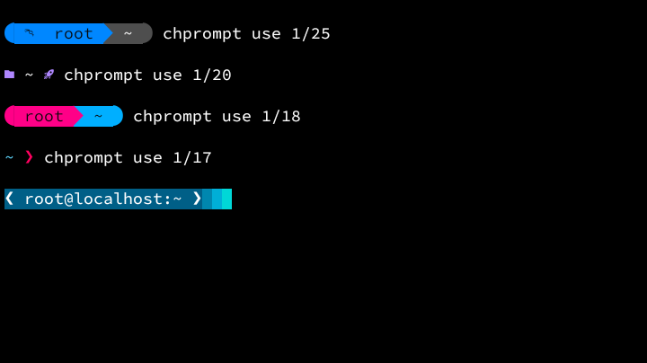
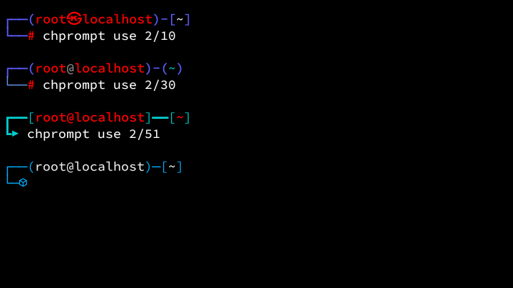
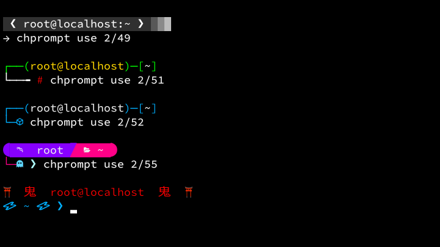

<!-- Chprompt Project -->

[]()
[]()
[](LICENSE)

# Chprompt
Chprompt is a simple, lightweight, and zero-dependency tool to switch your Linux PS1 prompt instantly. <br>
Choose from over 100+ built-in prompt styles. <br>

## Preview
<details>
<summary>Show Preview</summary>
<br>

<br><br>

<br><br>

<br>
</details>

## Features
- **Native PS1 Management:** Changes your prompt using native shell capabilities for maximum compatibility.
- **Live Preview Mode:** Test and visualize each style instantly before applying changes.
- **Session-Based Styling:** Apply a new look temporarily for your current terminal session only.
- **Persistent Configuration:** Option to set your favorite style permanently across all future sessions.

## Disclaimer
- **File Modification:** Chprompt modifies your .bashrc. While it is theoretically safe—as it filters line-by-line and creates a backup of your original .bashrc—please use it only if you are confident with these changes.
- **Shell Compatibility:** This tool is specifically designed for Bash (.bashrc). Forcing it to run on Zsh (.zshrc) or other shells may lead to compatibility issues.
- **Visual Requirements:** Some advanced prompt styles require Nerd Fonts to display icons and symbols correctly.

## Testing
<table>
	<tr>
		<th>OS</th>
		<th>Version</th>
	</tr>
    <tr>
        <td>Debian</td>
        <td>Trixie</td>
    </tr>
    <tr>
        <td>Kali</td>
        <td>Rolling</td>
    </tr>
    <tr>
        <td>Alpine</td>
        <td>3.23</td>
    </tr>
	<tr>
		<td>Termux</td>
		<td>0.118.3</td>
	</tr>
</table>

## Installation
```bash
git clone https://github.com/Zeronetsec/Chprompt.git
cd Chprompt
chmod +x install.sh
./install.sh
```

## Usage
``` bash
chprompt --preview <line>/<prompt_number>
chprompt --use <line>/<prompt_number>
chprompt --inject <line>/<prompt_number>
chprompt --help
chprompt --version
```

## License
This project is licensed under the MIT License. <br>

<!-- Copyright (c) 2026 Zeronetsec -->